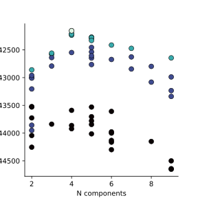

LocusRegression Tutorial
************************

LocusRegression is a statistical model which explains the observed mutations in a dataset of genomes, 
where each genome is described by a mixture of different processes which generated its mutations.
Processes, in turn, have a characteristic bias with respect to which genomic loci and nucleotides it affects. 
We model the locus bias of different processes with respect to their association with known genomic correlates 
like gene expression, acetylation, replication timing, etc. For each process, its mutational signature and association with
genomic correlates are inferred jointly from the data using a variational EM estimation method.

In this tutorial, I will explain how to:

1. Prepare and compile a dataset for modeling
2. Find the number of signatures which describes mutational processes in your data
3. Infer parameters of the generative model
4. Analyze the results

To start, you need to have the *locusregression* package, *bedtools*, *bcftools*, and *bigWigAverageOverBed* installed in a conda environemnt. You can check this quickly by running:

.. code-block:: bash

    $ locusregression && bedtools && bcftools && bigWigAverageOverBed

If one of these is not installed:

.. code-block:: bash

    $ conda install -c conda-forge -c bioconda -y bedtools bcftools ucsc-bigwigaverageoverbed 
    
Next, for data you will need:

* VCF files with SBS mutations
* Any number of -or combination of- genomic correlates for your system
* A fasta file of your organism's genome (e.g. h19.fa)
* A chromsizes file of your organism's genome (e.g. hg19.chrom.sizes)

1. Data preparation
-------------------

**Regions**

First, we need to define some genomic regions which will serve as our "windows", or a segment of the genome which we
consider a locus. There are many ways one could define these regions, and simply dividing the genome into 
high-resolution 10-kilobase bins as I do is but one option.

To start, I define a "genome" or "chrom sizes" file from a fasta:

.. code-block:: bash
    
    $ mkdir -p tutorial
    $ samtools faidx genomes/hg19.fa
    $ cut -f1-2 genomes/hg19.fa.fai | sort -k1,1 | grep -vE "^chr[0-9Un]_" > tutorial/genome.txt

When modeling the full genome, it is a good idea to define a genome with only main chromosomes (chr1-N), removing alt scaffolds, etc.

Next, we can make our windows using the convenient command from bedtools:

.. code-block:: bash

    $ bedtools makewindows -g tutorial/genome.txt -w 10000 > tutorial/regions.bed

..

   **Note:**
   It is worthwhile to check that your windows are in sorted order, or you'll run into
   problems down the line:

   .. code-block:: bash

        $ sort -k1,1 -k2,2n --check tutorial/regions.bed

Another good idea is to remove regions of the genome which are hard to map or are known to caused biased signals. For instance, you could
remove ENCODE blacklist regions from your region set:

.. code-block:: bash

    $ bedtools intersect -v -a tutorial/regions.bed -b encode.blacklist.bed > tutorial/filtered_regions.bed \
        && mv tutorial/filtered_regions.bed tutorial/regions.bed

The last annotation set up step is to generate a trinucleotide context distribution matrix, which helps the model to adjust for
sequence content differences across the genome:

.. code-block:: bash

    $ locusregression trinucs -r tutorial/regions.bed -fa genomes/hg19.fa -o tutorial/trinucs.npz

**Correlates**

Next, we need to associate each of our windows with values for some interesting genomic correlates. I provide a method to download
and process RoadMap data for a given cell line or cell type. All you must provide are the RoadMap ID of interest (in this case for 
Esophogeal cells), and the regions file.

.. code-block:: bash

    $ locusregression -id E079 -w tutorial/regions.bed -j 5 -o tutorial/correlates.tsv

Check the output of this method to see the output format:

.. code-block:: bash

    $ head tutorial/correlates.tsv

.. csv-table:: 
    :file: docs/example_features.tsv
    :header-rows: 1

A typical correlates file is a tab-separated matrix which has the same number of rows as the windows file. Each column is
annotated with a name prepended with "#". You can expand this correlates file as need to add additional features.

Besides RoadMap, you can also use any other genomic correlate you wish. For instance, you could download a bigWig file of
gene expression and use the `locusregression ingest-bigwig` or `locusregression ingest-bedgraph` tool to get the average expression in each window:

.. code-block:: bash

    $ locusregression ingest-bigwig \
        example.bigwig \
        -w tutorial/regions.bed \
        -norm power \
        -name GEX \
        -o tutorial/expression.tsv

This method requires a feature name and optionally a normalization method. The `power` normalization 
is a zero-safe log transformation followed by standardization. Other options are `standardize` and `minmax`,
which convert features to z-scores or fixes their ranges to 0-1, respectively. If no normalization is desired,
just omit the `-norm` flag.

You can put together any ad-hoc combination of features into one tsv file using the `paste` command.

**The locusregression software will not adjust the features you provide, so
be sure to standardize them beforehand.**

**Exposures**

The last data that we need to feed the model are "exposures" - which are technical
effects that could explain variation in the number of mutations we see for each window/locus. Supplying these
exposures allows the model to correct for their effects when modeling variable mutation rates across the genome.

A simple exposure one could provide is the read coverage within each window, which may be roughly proportional
to the ability to call a mutation at that locus. More sohpisticated models of sensitivity can also be used.

Provide exposures as a single column of positive values (a header is optional and is ignored):

.. code-block:: bash

    $ head -n3 exposures.txt
      0.01
      0.05
      0.45

The exposure file is the only optional input.

**Compiling a corpus**

A "Corpus" is a a normalized and reformatted view of the data which is read by the LocusRegression model, and
associates a set of mutations from multiple VCFs to some genomic correlates. The 
structure of your corpus also helps LocusRegression find the fastest method to perform parameter updates. 
Since we could assume samples from a certain cancer type have similar correlates, we can group all of the 
VCFs from a certain cancer type to type-specific correlates. If you wish to model multiple types together, 
just provide multiple corpuses to any of the methods below.

To produce a corpus for some hypothetical set of samples stored in `vcfs.txt`:

.. code-block:: bash

    $ locusregression make-corpus \
        -vcf `cat vcfs.txt` \
        -fa hg19.fa \
        --regions-file tutorial/regions.bed \
        --correlates-file tutorial/correlates.tsv \
        --trinuc tutorial/trinucs.npz \
        -o tutorial/corpus.h5 \
        --chr-prefix chr # the VCF files only have numbers, but RefSeq has "chr1", for example

This will save the corpus to *tutorial/corpus.h5*.

2. How many processes?
----------------------

Choosing the number of mixture components to describe a process is a perenial problem in topic modeling,
LocusRegression notwithstanding. Here, I employ random search of the model hyperparameter space paired
with a HyperBand bandit to find the number of components which produces a descriptive but 
generalizeable model. This process can be parallelized for faster tuning.

First, create a new "study", which will attempt to find the best hyperparameters for a certain model 
and data configuration:

.. code-block:: bash

    $ locusregression create-study \    
        --corpuses tutorial/corpus.h5 \
        -min 3 -max 12 \
        --tune-subsample \
        --study-name tutorial.1 \
        --fix-signatures SBS1 SBS2

    [I 2023-10-29 16:12:11,918] A new study created in Journal with name: tutorial.1

The `--fix-signatures` flag is optional, and allows you to fix the signatures of certain processes to
known mutational signatures.

Now, by running the command:

.. code-block:: bash

    $ locusregression run-trial tutorial.1

and referencing the study name, a model is trained with a random set of hyperparameters and the result 
saved to the study. This process can be repeated as many times as desired, and can be parallelized.
I recommend running 100-200 trials to get a good sense of the hyperparameter space. Trials can be run
serially:

.. code-block:: bash

    $ for i in {1..100}; do locusregression run-trial tutorial.1 > $i.log 2>&1; done

or, in parallel while controlling the number of cores by having each process run a certain number of trials:

.. code-block:: bash

    $ for i in {1..5}; do locusregression run-trial tutorial.1 -i 40 > $i.log 2>&1 & done

The command above launches five processes in the background, each of which tries 40 model configurations.
Using a slurm server, one can simultaneously run numerous trials in different processes. I recommend
allocating 1500MB and 1 CPU per trial.

One can visualize the study results using the `optuna` module:

.. code-block:: python

    from optuna.visualization.matplotlib import *
    from locusregression import load_study

    study, dataset, training_attrs = load_study('tutorial.1')
    plot_slice(study, params = ['n_components'])

If you already know how many processes are present in a sample, you can just do the following, and skip
step 3:

.. code-block:: bash

    $ locusregression train-model -k 5 -d tutorial/corpus.h5 -o tutorial/model.pkl

 
1. Training the model
---------------------

To train the representative model for the dataset, use the `locusregression retrain` command, 
again referencing the study name. By default, locusregression will choose the best model to retrain. If 
desired, you can choose some other model configuration by specifying `--trial-num <num>`. 

.. code-block:: bash

    $ locusregression retrain \
        tutorial.1 \
        -o tutorial/model.pkl

4. Analysis
-----------

.. code-block:: bash

    $ locusregression model-predict tutorial/model.pkl -d tutorial/corpus.h5 -o tutorial/exposures.csv

    $ locusregression model-save-associations tutorial/model.pkl -o tutorial/associations.csv
    $ locusregression model-save-signatures tutorial/model.pkl -o tutorial/signatures.csv

    $ locusregression model-plot-summary tutorial/model.pkl -o tutorial/summary.pdf
    $ locusregression model-plot-coefs tutorial/model.pkl -o tutorial/associations.pdf

1. Summary
----------

Altogether, the steps to start an analysis are:

.. code-block:: bash

    #1. Set up genome annotations

    #1.1 Make genome file
    $ samtools faidx genomes/hg19.fa
    $ cut -f1-2 genomes/hg19.fa.fai | sort -k1,1 | grep -vE "^chr[0-9Un]_" > tutorial/genome.txt
    
    #1.2 Make windows file 
    $ bedtools makewindows -g tutorial/genome.txt -w 10000 > tutorial/regions.bed
    $ sort -k1,1 -k2,2n --check tutorial/regions.bed
    
    $ bedtools intersect -v -a tutorial/regions.bed -b encode.blacklist.bed > tutorial/filtered_regions.bed \
        && mv tutorial/filtered_regions.bed tutorial/regions.bed

    #1.3 Make trinucleotide file
    $ locusregression trinucs -r tutorial/regions.bed -fa genomes/hg19.fa -o tutorial/trinucs.npz

    #2. Make features matrix
    $ locusregression -id E079 -w tutorial/regions.bed -j 5 -o tutorial/E110-marks.tsv

    $ <normalization script here, I use scikit-learn\'s PowerTransformer>

    #3. Compile corpus
    $ locusregression make-corpus \
        -vcf `cat vcfs.txt` \
        -fa hg19.fa \
        --regions-file tutorial/regions.bed \
        --correlates-file tutorial/correlates.tsv \
        --trinuc tutorial/trinucs.npz \
        -o tutorial/corpus.h5

    # 4. Find hyperparameters 
    $ locusregression tune \    
        --corpus tutorial/corpus.pkl \
        -min 3 -max 12 \
        --n-jobs 5 \
        --tune-subsample \
        -o tutorial/tune_results.json

    # 5. Retrain final model on whole corpus
    $ locusregression retrain \
        -d tutorial/corpus.pkl \
        -o tutorial/model.pkl \
        --tune-results tutorial/tune_results.json
