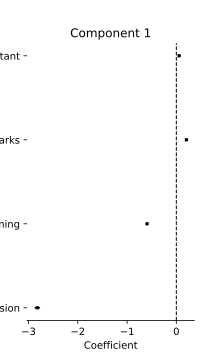
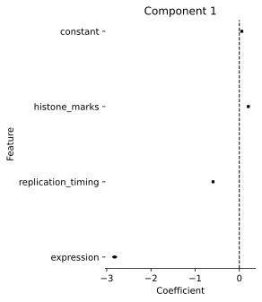

LocusRegression Tutorial
************************

LocusRegression is a statistical model which explains the observed mutations in a dataset of genomes, 
where each genome is described by a mixture of different processes which generated its mutations.
Processes, in turn, have a characteristic bias with respect to which genomic loci and nucleotides it affects. 
We model the locus bias of different processes with respect to their association with known genomic correlates 
like gene expression, acetylation, replication timing, etc. For each process, its mutational signature and association with
genomic correlates are inferred jointly from the data using a variational EM estimation method.

In this tutorial, I will explain how to:

1. Prepare and compile a dataset for modeling
2. Find the number of signatures which describes mutational processes in your data
3. Infer parameters of the generative model
4. Analyze the results

To start, you need to have the *locusregression* package and *bedtools* installed in a conda environemnt. You can check this
quickly by running:

.. code-block:: bash

    $ locusregression && bedtools
    
Next, for data you will need:

* VCF files with SBS mutations
* Any number of -or combination of- genomic correlates for your system
* A fasta file of your organism's genome (e.g. h19.fa)
* A chromsizes file of your organism's genome (e.g. hg19.chrom.sizes)

1. Data preparation
-------------------

**Regions**

First, we need to define some genomic regions which will serve as our "windows", or a segment of the genome which we
consider a locus. There are many ways one could define these regions, and simply dividing the genome into 
high-resolution 10-kilobase bins as I do is but one option.

To start, I define a "genome" or "chrom sizes" file from a fasta:

.. code-block:: bash
    
    $ mkdir -p tutorial
    $ samtools faidx ~/genomes/hg19.fa
    $ cut -f1-2 ~/genomes/hg19.fa.fai | sort -k1,1 | grep -vE "^chr[0-9Un]_" > tutorial/genome.txt

When modeling the full genome, it is a good idea to define a genome with only main chromosomes (chr1-N), removing alt scaffolds, etc.

Next, we can make our windows using the convenient command from bedtools:

.. code-block:: bash

    $ bedtools makewindows -g tutorial/genome.txt -w 10000 > tutorial/regions.bed

..

   **Note:**
   It is worthwhile to check that your windows are in sorted order, or you'll run into
   problems down the line:

   .. code-block:: bash

        $ sort -k1,1 -k2,2n --check tutorial/regions.bed

Another good idea is to remove regions of the genome which are hard to map or are known to caused biased signals. For instance, you could
remove ENCODE blacklist regions from your region set:

.. code-block:: bash

    $ bedtools intersect -v -a tutorial/regions.bed -b encode.blacklist.bed > tutorial/filtered_regions.bed \
        && mv tutorial/filtered_regions.bed tutorial/regions.bed

The last annotation set up step is to generate a trinucleotide context distribution matrix, which helps the model to adjust for
sequence content differences across the genome:

.. code-block:: bash

    $ locusregression trinucs -r tutorial/regions.bed -fa ~/genomes/hg19.fa -o tutorial/trinucs.npz

**Correlates**

Next, we need to associate each of our windows with values for some interesting genomic correlates. I provide a method to download
and process RoadMap data for a given cell line or cell type. All you must provide are the RoadMap ID of interest (in this case for 
Esophogeal cells), and the regions file.

.. code-block:: bash

    $ locusregression -id E079 -w tutorial/regions.bed -j 5 -o tutorial/E110-marks.tsv

Check the output of this method to see the output format:

.. code-block:: bash

    $ head tutorial/correlates.tsv

A typical correlates file is a tab-separated matrix which has the same number of rows as the windows file. Each column is
annotated with a name prepended with "#". You can expand this correlates file as need to add additional features.

..

    **Note:**
    Again, it is very important to keep these data sorted and normalized. Above, 
    I include the `-sorted` flag in `bedtools map` to ensure ensure this. Also, I
    set `-null 0.0` so that winows which are not included in the track are still
    assigned a numerical value.
    
**The locusregression software will not adjust the features you provide, so
be sure to standardize them beforehand.**

**Exposures**

The last data that we need to feed the model are "exposures" - which are technical
effects that could explain variation in the number of mutations we see for each window/locus. Supplying these
exposures allows the model to correct for their effects when modeling variable mutation rates across the genome.

A simple exposure one could provide is the read coverage within each window, which may be roughly proportional
to the ability to call a mutation at that locus. More sohpisticated models of sensitivity can also be used.

Provide exposures as a single column of positive values (a header is optional and is ignored):

.. code-block:: bash

    $ head -n3 exposures.txt
      0.01
      0.05
      0.45

The exposure file is the only optional input.

**Compiling a corpus**

A "Corpus" is a a normalized and reformatted view of the data which is read by the LocusRegression model, and
associates a set of mutations from multiple VCFs to some genomic correlates. The 
structure of your corpus also helps LocusRegression find the fastest method to perform parameter updates. 
Since we could assume samples from a certain cancer type have similar correlates, we can group all of the 
VCFs from a certain cancer type to type-specific correlates. If you wish to model multiple types together, 
just provide multiple corpuses to any of the methods below.

To produce a corpus for some hypothetical set of samples stored in `vcfs.txt`:

.. code-block:: bash

    $ locusregression make-corpus \
        -vcf `cat vcfs.txt` \
        -fa hg19.fa \
        --regions-file tutorial/regions.bed \
        --correlates-file tutorial/correlates.tsv \
        --trinuc tutorial/trinucs.npz \
        -o tutorial/corpus.h5

This will save the corpus to *tutorial/corpus.h5*.

1. How many processes?
----------------------

Choosing the number of mixture components to describe a process is a perenial problem in topic modeling,
LocusRegression notwithstanding. Here, I employ random search of the model hyperparameter space paired
with a HyperBand bandit to find the number of components which produces a descriptive but 
generalizeable model. This process can be parallelized for faster tuning.

To run the *tune* command, you have to give the path to corpus, as well as the minimum and maximum
bounds on the number of components to try. This command outputs a *json* file of scores for different
model configurations.

.. code-block:: bash

    $ locusregression tune \    
        --corpus tutorial/corpus.pkl \
        -min 3 -max 12 \
        --n-jobs 5 \
        --locus-subsample-rate 0.01 0.05 0.1
        --tune-subsample \
        -o tutorial/tune_results.json \

    Running HyperBand with 8 jobs.
    Bracket 1: Evaluating 8 models
    Bracket 2: Evaluating 15 models
    Bracket 3: Evaluating 24 models
    Evaluating model configurations:   100%|██████████████████████| 1282/1282 [00:27<07:35,  2.67it/s]

We can plot the results in the *tutorial/data.json* file to see which values for *n_components* make sense
for the dataset:

.. code-block:: python

    import pandas as pd
    import matplotlib.pyplot as plt
    import seaborn as sns
    import numpy as np

    data = pd.read_json('tutorial/data.json', sep = '\t')

    data['log_resources'] = np.log(data.resources)

    sns.scatterplot(
        data = data,
        x = 'param_n_components',
        y = 'score',
        hue = 'log_resources',
        palette='mako',
        s = 50,
        edgecolor = 'black',
        ax = ax,
    )
    sns.despine()
    ax.set(ylabel = 'Score', xlabel = 'N components')

.. image:: images/tuning.svg
    :width: 400

The HyperBand algorith runs "tournaments", where models are trained for a certain number of 
epochs, then tested. The best performing models are promoted to the next iteration and trained 
for more epochs (granted more resources). This process repeats until a group of winners is chosen.

Here, four or five components gives a good fit for the dataset.

1. Training the model
---------------------

To train the representative model for the dataset, provide paths for the corpus, output, and 
the tuning results. By default, locusregression will choose the best model to retrain. If 
desired, you can choose some other model configuration by specifying `--trial-num <num>`. 

.. code-block:: bash

    $ locusregression retrin \
        -d tutorial/corpus.pkl \
        -o tutorial/model.pkl \
        --tune-results tutorial/tune_results.json

4. Analysis
-----------

For this section, it is most natural to use an interactive tool like Jupyter notebooks to explore
the model and data. First, let's import some packages:

.. code-block:: python

    import locusregression
    import seaborn as sns
    import matplotlib.pylot as plt

The first thing we can do with a trained model is to see what signatures were uncovered and 
what genomic correlates they were associated with.

Load the model:

.. code-block:: python

    model = locusregression.load('tutorial/model.pkl')

Then, plot a signature like so:

.. code-block:: python

    model.plot_signature(1)

And to see the signature's genomic correlate regression coefficients:

.. code-block:: python

    model.plot_coefficients(1)

This component is very anticorrelated with expressed genes, and looks something like
COSMIC signature SBS17b.

The locusregression model computes a posterior distribution for each
mutation which describes the probability that it was generated by each component/process. 
The model also calculates a mutation rate for each sample which is conditioned on the 
processes defining it.

We can compute and visualize these locus-based attributes of the data:

.. code-block:: bash

    corpus = locusregression.load_corpus('tutorial/corpus.pkl') # load corpus

    phi = model.get_phi_locus_distribution(corpus) # compute posterior over components for each mutation

    mutation_rate = model.get_expected_mutation_rate(corpus[2]) # get mutation rate for a sample

Now, we can plot. The top plot shows the probability that each mutation was generated by process 1. Next,
I plot the expression correlate. Last, I show the expected mutation rate across loci. The true loci
of the mutations are plotted as rug on the bottom plot. 

.. code-block:: bash

    fig, ax = plt.subplots(3,1,figsize=(20,4), sharex=True)
    
    sns.scatterplot(
        x = range(model.n_loci),
        y = phi[1], # plot first process
        s = 1,
        ax = ax[0],
        color = sns.color_palette("Set1")[0],
    )

    sns.scatterplot(
        x = range(model.n_loci),
        y = corpus[0]['X_matrix'][0,:],
        s = 1,
        ax = ax[1],
        color = sns.color_palette("Set1")[1],
    )

    sns.scatterplot(
        x = range(model.n_loci),
        y = mutation_rate,
        color = sns.color_palette("Set1")[2],
        s = 1,
        ax = ax[2],
    )

    sns.rugplot(
        x = corpus[0]['locus'],
        ax = ax[2],
        height=0.1,
        alpha = 0.1,
        color = 'black',
    )
    ax[0].set(ylabel = 'P(z=1 | m, l)')
    ax[1].set(ylabel = 'Expression')
    ax[2].set(ylabel = 'Mutation rate')
    sns.despine()

.. image:: images/mutation_rate.svg
    :width: 800

Some areas of high mutational density are accounted for, but clearly more feature are needed to 
get a better fit.

Finally, to get the posterior distribution over processes for each sample, you can use:

.. code-block:: bash

    processes = model.predict(corpus)

